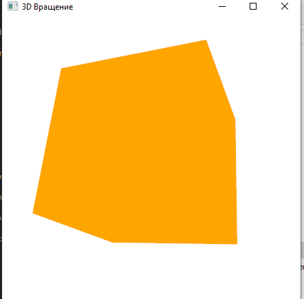

Для создания 3D-фигуры и анимации вращения в WPF (C#) используется пространство имен **`System.Windows.Media.Media3D`**.

WPF использует **DirectX** для рендеринга 3D, но оборачивает это в XAML и C#. Вот два основных подхода: **XAML + Code-behind** (самый простой) и **чистый C#** (динамическое создание).

Ниже я покажу полный рабочий пример с анимацией вращения.

---

### Способ 1: Чистый C# код (Динамическое создание)

Этот метод хорош, если вы генерируете геометрию программно.

Создайте окно WPF и вставьте следующий код в `MainWindow.xaml.cs`:

```csharp
using System;
using System.Windows;
using System.Windows.Media;
using System.Windows.Media.Animation;
using System.Windows.Media.Media3D;

namespace Wpf3DExample
{
    public partial class MainWindow : Window
    {
        public MainWindow()
        {
            InitializeComponent();
            Create3DScene();
        }

        private void Create3DScene()
        {
            // 1. Создаем Viewport (холст для 3D)
            var viewport = new Viewport3D();

            // 2. Создаем Камеру (перспективная)
            var camera = new PerspectiveCamera();
            camera.Position = new Point3D(0, 0, 5); // Позиция
            camera.LookDirection = new Vector3D(0, 0, -5); // Куда смотрим
            camera.UpDirection = new Vector3D(0, 1, 0);
            viewport.Camera = camera;

            // 3. Создаем источник света (обязательно, иначе фигура черная)
            var ambientLight = new AmbientLight(Colors.White);

            // 4. СОЗДАЕМ КУБ (3D фигуру)
            MeshGeometry3D mesh = new MeshGeometry3D();

            // Простой куб (8 вершин, 12 треугольников)
            // Координаты вершин
            Point3DCollection positions = new Point3DCollection();
            positions.Add(new Point3D(-1, -1, -1));
            positions.Add(new Point3D(1, -1, -1));
            positions.Add(new Point3D(1, 1, -1));
            positions.Add(new Point3D(-1, 1, -1));
            positions.Add(new Point3D(-1, -1, 1));
            positions.Add(new Point3D(1, -1, 1));
            positions.Add(new Point3D(1, 1, 1));
            positions.Add(new Point3D(-1, 1, 1));
            mesh.Positions = positions;

            // Индексы треугольников (каждые 3 точки = 1 треугольник)
            Int32Collection indices = new Int32Collection();
            // Задняя грань
            indices.Add(0); indices.Add(2); indices.Add(1);
            indices.Add(0); indices.Add(3); indices.Add(2);
            // Передняя грань
            indices.Add(4); indices.Add(5); indices.Add(6);
            indices.Add(4); indices.Add(6); indices.Add(7);
            // Левая грань
            indices.Add(0); indices.Add(7); indices.Add(3);
            indices.Add(0); indices.Add(4); indices.Add(7);
            // Правая грань
            indices.Add(1); indices.Add(2); indices.Add(6);
            indices.Add(1); indices.Add(6); indices.Add(5);
            // Верхняя грань
            indices.Add(3); indices.Add(7); indices.Add(6);
            indices.Add(3); indices.Add(6); indices.Add(2);
            // Нижняя грань
            indices.Add(0); indices.Add(1); indices.Add(5);
            indices.Add(0); indices.Add(5); indices.Add(4);
            mesh.TriangleIndices = indices;

            // Нормали (чтобы свет падал правильно)
            mesh.Normals = new Vector3DCollection();
            foreach (var pos in positions)
                mesh.Normals.Add((Vector3D)pos); // Упрощенно для куба со смещением

            // 5. Создаем Материал (цвет)
            DiffuseMaterial material = new DiffuseMaterial(new SolidColorBrush(Colors.Orange));

            // 6. Собираем Модель
            GeometryModel3D model = new GeometryModel3D(mesh, material);

            // 7. Помещаем модель в группу (чтобы вращать всю группу целиком)
            Model3DGroup group = new Model3DGroup();
            group.Children.Add(ambientLight);
            group.Children.Add(model);

            // 8. Добавляем в Viewport
            viewport.Children.Add(new ModelVisual3D() { Content = group });

            // 9. Добавляем Viewport в окно
            this.Content = viewport;

            // 10. АНИМАЦИЯ ВРАЩЕНИЯ
            RotateTransform3D rotationTransform = new RotateTransform3D();
            group.Transform = rotationTransform;

            // Ось вращения (Y - вертикальная, X - горизонтальная)
            AxisAngleRotation3D axisRotation = new AxisAngleRotation3D(new Vector3D(1, 1, 0), 0);
            rotationTransform.Rotation = axisRotation;

            // Создаем анимацию (от 0 до 360 градусов за 10 секунд)
            DoubleAnimation rotationAnimation = new DoubleAnimation();
            rotationAnimation.From = 0;
            rotationAnimation.To = 360;
            rotationAnimation.Duration = new Duration(TimeSpan.FromSeconds(10));
            // Бесконечное повторение
            rotationAnimation.RepeatBehavior = RepeatBehavior.Forever;

            // Запускаем анимацию
            axisRotation.BeginAnimation(AxisAngleRotation3D.AngleProperty, rotationAnimation);
        }
    }
}
```

---

### Способ 2: XAML + Code-behind (Рекомендуется)

Разделение интерфейса и логики. Это стандарт WPF.

**MainWindow.xaml:**
```xml
<Window x:Class="WpfApp3D.MainWindow"
        xmlns="http://schemas.microsoft.com/winfx/2006/xaml/presentation"
        xmlns:x="http://schemas.microsoft.com/winfx/2006/xaml"
        Title="3D Вращение" Height="450" Width="450">

    <Grid>
        <Viewport3D Name="MyViewport">

            <!-- Камера -->
            <Viewport3D.Camera>
                <PerspectiveCamera Position="0,0,5" LookDirection="0,0,-5" UpDirection="0,1,0"/>
            </Viewport3D.Camera>

            <!-- Модели -->
            <ModelVisual3D>
                <ModelVisual3D.Content>
                    <Model3DGroup>

                        <!-- Свет -->
                        <AmbientLight Color="White"/>
                        <DirectionalLight Color="LightGray" Direction="-1,-1,-1"/>

                        <!-- Сама фигура (Куб с закруглениями или просто куб) -->
                        <GeometryModel3D>
                            <GeometryModel3D.Geometry>
                                <MeshGeometry3D Positions="-1,-1,-1  1,-1,-1  1,1,-1  -1,1,-1  -1,-1,1  1,-1,1  1,1,1  -1,1,1"
                                                TriangleIndices="0,2,1  0,3,2  4,5,6  4,6,7  0,7,3  0,4,7  1,2,6  1,6,5  3,7,6  3,6,2  0,1,5  0,5,4"/>
                            </GeometryModel3D.Geometry>

                            <GeometryModel3D.Material>
                                <DiffuseMaterial Brush="Orange"/>
                            </GeometryModel3D.Material>

                            <!-- Трансформация для вращения -->
                            <GeometryModel3D.Transform>
                                <RotateTransform3D>
                                    <RotateTransform3D.Rotation>
                                        <AxisAngleRotation3D x:Name="RotationAxis" Axis="1,1,0" Angle="0"/>
                                    </RotateTransform3D.Rotation>
                                </RotateTransform3D>
                            </GeometryModel3D.Transform>

                        </GeometryModel3D>
                    </Model3DGroup>
                </ModelVisual3D.Content>
            </ModelVisual3D>
        </Viewport3D>
    </Grid>
</Window>
```

**MainWindow.xaml.cs (Запуск анимации):**
```csharp
using System;
using System.Windows;
using System.Windows.Media.Animation;
using System.Windows.Media.Media3D;

namespace WpfApp3D
{
    public partial class MainWindow : Window
    {
        public MainWindow()
        {
            InitializeComponent();
            StartRotation();
        }

        private void StartRotation()
        {
            // Находим наш объект по имени (x:Name="RotationAxis")
            AxisAngleRotation3D rotation = this.RotationAxis;

            // Создаем анимацию
            DoubleAnimation animation = new DoubleAnimation();
            animation.From = 0;
            animation.To = 360;
            animation.Duration = new Duration(TimeSpan.FromSeconds(8));
            animation.RepeatBehavior = RepeatBehavior.Forever;

            // Запускаем
            rotation.BeginAnimation(AxisAngleRotation3D.AngleProperty, animation);
        }
    }
}
```

---

### Важные моменты для понимания:

1.  **Camera** — определяет, откуда вы смотрите (`Position`) и куда (`LookDirection`).
2.  **MeshGeometry3D** — это сетка из треугольников. Любая сложная фигура (сфера, цилиндр) строится из множества треугольников.
3.  **Material** — отвечает за цвет и текстуру. `DiffuseMaterial` — матовый, `SpecularMaterial` — глянцевый.
4.  **Transform** — трансформация. Для вращения нужен `RotateTransform3D` и `AxisAngleRotation3D` (задает ось).

---

### Как нарисовать более сложные фигуры (Сфера, Цилиндр)?

В WPF **нет** встроенных классов `SphereMesh` или `CylinderMesh`. Их нужно генерировать вручную через циклы (сферические координаты).

**Пример генерации сферы (C#):**
```csharp
private static MeshGeometry3D CreateSphere(double radius, int slices, int stacks)
{
    var mesh = new MeshGeometry3D();
    for (int i = 0; i <= stacks; i++)
    {
        double theta = Math.PI * i / stacks;
        for (int j = 0; j <= slices; j++)
        {
            double phi = 2 * Math.PI * j / slices;
            double x = radius * Math.Sin(theta) * Math.Cos(phi);
            double y = radius * Math.Cos(theta);
            double z = radius * Math.Sin(theta) * Math.Sin(phi);
            mesh.Positions.Add(new Point3D(x, y, z));
        }
    }
    // ... Добавление индексов для треугольников
    return mesh;
}
```

Если вам не хочется писать геометрию вручную, используйте библиотеку **Helix Toolkit** (NuGet), она содержит готовые примитивы (`Sphere`, `Box`, `Cylinder`).

```
ок а теперь словами опиши как работает с кубом
у меня есть 8 точек координаты и что с ними делаем
```

Отлично! Давайте разберем **по шагам** на пальцах, что происходит с этими 8 точками, когда мы рисуем 3D-куб в WPF.

---

## 1. Точки — это просто «вершины»

У нас есть 8 точек в **трехмерном пространстве** (X, Y, Z).  
Центр куба находится в точке `(0,0,0)`, поэтому координаты идут от `-1` до `+1`:

- `(-1,-1,-1)` — левый-нижний-задний
- `(1,-1,-1)`  — правый-нижний-задний
- `(1,1,-1)`   — правый-верхний-задний
- `(-1,1,-1)`  — левый-верхний-задний

Эти 4 точки образуют **заднюю грань**.

- `(-1,-1,1)` — левый-нижний-передний
- `(1,-1,1)`  — правый-нижний-передний
- `(1,1,1)`   — правый-верхний-передний
- `(-1,1,1)`  — левый-верхний-передний

Эти 4 точки образуют **переднюю грань**.

> **Важно:** Сами по себе точки — это просто массив чисел. Компьютер пока не знает, как соединить их в куб.

---

## 2. Что мы делаем с точками дальше?

Мы передаем их в свойство **`Positions`** у объекта `MeshGeometry3D`:

```csharp
mesh.Positions = positions; // вот здесь 8 точек загружены в память
```

Теперь у нас есть **8 вершин**, но это еще не фигура. Это просто «облако точек».

---

## 3. Соединяем точки в треугольники (самый важный шаг)

3D-объекты в WPF (и в любом 3D-движке) строятся из **треугольников**.  
Куб состоит из **6 граней**, каждая грань — это **2 треугольника**.  
Итого: **12 треугольников**.

Чтобы задать треугольник, мы **ссылаемся на номера точек** из нашего списка `Positions`.

**Нумерация точек (индексы):**
```
0: (-1,-1,-1)
1: (1,-1,-1)
2: (1,1,-1)
3: (-1,1,-1)
4: (-1,-1,1)
5: (1,-1,1)
6: (1,1,1)
7: (-1,1,1)
```

Теперь берем **заднюю грань** (Z = -1). Она состоит из точек 0, 1, 2, 3.

Разбиваем квадрат на два треугольника:
- **Первый треугольник:** точки 0, 2, 1
- **Второй треугольник:** точки 0, 3, 2

Записываем индексы в `TriangleIndices`:
```csharp
indices.Add(0); indices.Add(2); indices.Add(1);
indices.Add(0); indices.Add(3); indices.Add(2);
```

И так для всех 6 граней.

---

## 4. Почему важен порядок точек в треугольнике?

**Порядок обхода** (по часовой или против часовой стрелки) определяет, **какая сторона треугольника считается «лицевой»**.

- Если точки перечислены **против часовой стрелки** (если смотреть со стороны камеры) — треугольник видимый.
- Если **по часовой** — треугольник невидимый (отбрасывается для производительности).

Это называется **«отсечение задних граней» (Backface Culling)**.

В примере с кубом я использовал порядок, который делает все наружные грани видимыми.

---

## 5. Зачем нужны нормали?

После того как мы задали точки и треугольники, у нас есть **геометрия**, но она выглядит плоской и черной.

Свойство **`Normals`** (нормали) — это векторы, перпендикулярные поверхности. Они нужны, чтобы **свет** правильно отражался от граней.

Для куба нормаль каждой грани должна «смотреть» наружу.  
В упрощенном примере я сделал так:

```csharp
foreach (var pos in positions)
    mesh.Normals.Add((Vector3D)pos);
```

Это работает только для куба, потому что координаты вершин совпадают с направлением нормалей (от центра к вершине). В реальных проектах нормали вычисляют отдельно для каждой грани.

---

## 6. Что происходит дальше?

После того как мы задали:
- **Positions** (8 точек)
- **TriangleIndices** (12 треугольников)
- **Normals** (векторы для света)

... WPF берет эту информацию, передает ее в **DirectX**, и тот отрисовывает на экране **треугольную сетку**, которая выглядит как куб.

Затем мы накладываем **материал** (цвет, текстуру) и включаем **свет**, чтобы куб стал объемным.

---

## 7. Анимация вращения — что происходит?

Когда мы запускаем анимацию угла от `0` до `360` градусов:

```csharp
axisRotation.BeginAnimation(AxisAngleRotation3D.AngleProperty, animation);
```

WPF **пересчитывает координаты всех 8 точек** в реальном времени (умножая их на матрицу поворота) и каждый кадр отправляет новые координаты в видеокарту.

Из-за этого создается иллюзия, что куб крутится. Сами точки в памяти **не меняются** — меняется только **трансформация**, которая применяется к ним перед отрисовкой.

---

## Итоговая схема (как это работает):

```
1. Задали 8 точек (Positions)
   ↓
2. Сказали, как соединить их в треугольники (TriangleIndices)
   ↓
3. Добавили нормали (Normals) для освещения
   ↓
4. Наложили цвет/текстуру (Material)
   ↓
5. Поместили все в сцену с камерой и светом
   ↓
6. Запустили анимацию вращения → WPF сам пересчитывает экран 60 раз в секунду
   ↓
7. Мы видим вращающийся куб!
```


---

## Простыми словами:

> Точки — это **каркас**.  
> Треугольники — это **стены** между точками.  
> Нормали — это **направление**, в котором стена «смотрит», чтобы свет падал правильно.  
> Анимация — это **приказ** крутить все это дело вокруг оси, не меняя самих точек.
