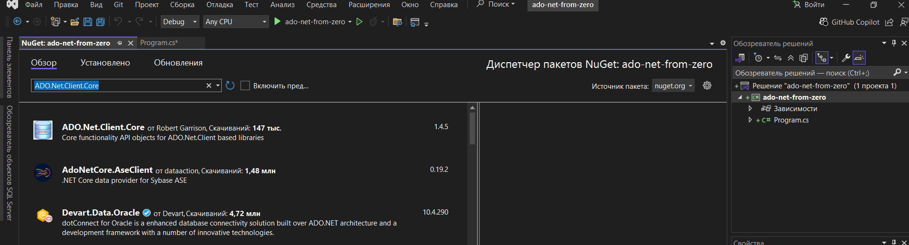
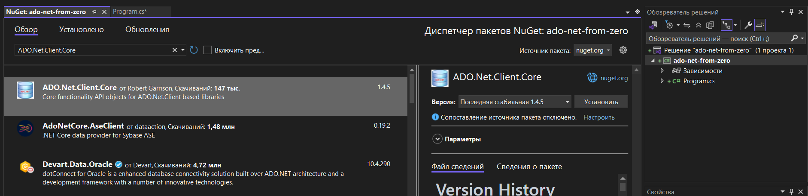
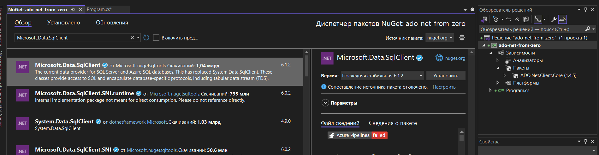
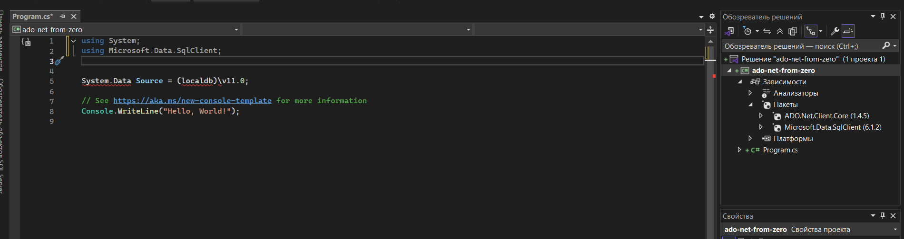

Создадим новое приложение  c#

# Установка пакетов

Нам понадобится установка пакетов
Меню `проект/Управление пакетами`

Найдите через Обзор пакеты
* ADO.Net.Client.Core
* Microsoft.Data.SqlClient
Нажмите установить, соглашайтесь на все вопросы







На рисунке ниже видно, что В обозревателе решений ,зависимости появились
2 пакета



# Создание подключения и базы

Для работы с пакетами крому установки через Управления пакетами, требуется
добавить пространсво имен

```cs
using System;
using Microsoft.Data.SqlClient;
```

# Инициализация клиента MS SQL
Далее объявим константы и переменные

```cs
SqlConnection conn = null;
const string ServerName = "(localdb)\\MSSQLLocalDB";
const string DatabaseName = "Library3";

new SqlConnection();

conn.ConnectionString = $@"Data Source={ServerName};
    Initial Catalog={DatabaseName};
    Integrated Security=SSPI;
    Pooling=false"; // Отключаем пуллинг для создания БД


```

# Создадим БД
Создадим подключение, обрати внимание что срока подключения другая

` Initial Catalog=master;` Это нужно для создания БД

```cs

  string masterConnectionString = $@"Data Source={ServerName};
         Initial Catalog=master;
         Integrated Security=SSPI;
         Pooling=false";

   using (var masterConn = new SqlConnection(masterConnectionString)) {
       masterConn.Open();
       // Создаем базу с правильной кодировкой для кириллицы
        var cmdCreateDb = new SqlCommand(
            $"CREATE DATABASE [{DatabaseName}] COLLATE Cyrillic_General_CI_AS",
            masterConn);
        cmdCreateDb.ExecuteNonQuery();
        Console.WriteLine("База данных создана с поддержкой кириллицы.");   
   }


```


# Создание таблицы
```cs

conn.Open();
  string createTableQuery = @"
  IF NOT EXISTS (SELECT * FROM sysobjects WHERE name='Authors' AND xtype='U')
  BEGIN
      CREATE TABLE Authors (
          Id INT IDENTITY(1,1) PRIMARY KEY,
          FirstName NVARCHAR(50) NOT NULL,
          LastName NVARCHAR(50) NOT NULL
      )
  END";

  SqlCommand cmd = new SqlCommand(createTableQuery, conn);
  cmd.ExecuteNonQuery();
```

# Вставка данных

```cs
conn.Open();
                // Используем параметризованный запрос для безопасности
                string insertString = @"
                    INSERT INTO Authors (FirstName, LastName)
                    VALUES (@FirstName, @LastName)";

                SqlCommand cmd = new SqlCommand(insertString, conn);

                // Добавляем параметры
                cmd.Parameters.AddWithValue("@FirstName", "Клиффорд");
                cmd.Parameters.AddWithValue("@LastName", "Саймак");

                cmd.ExecuteNonQuery();
                Console.WriteLine("Данные успешно добавлены!");

```              
