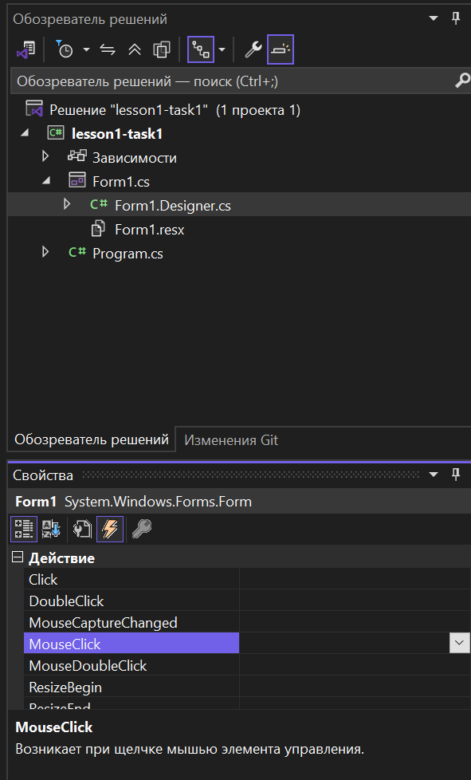
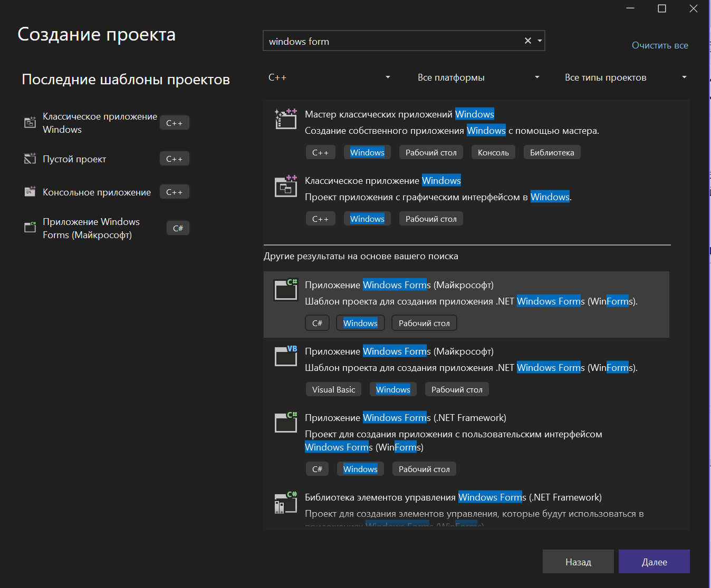
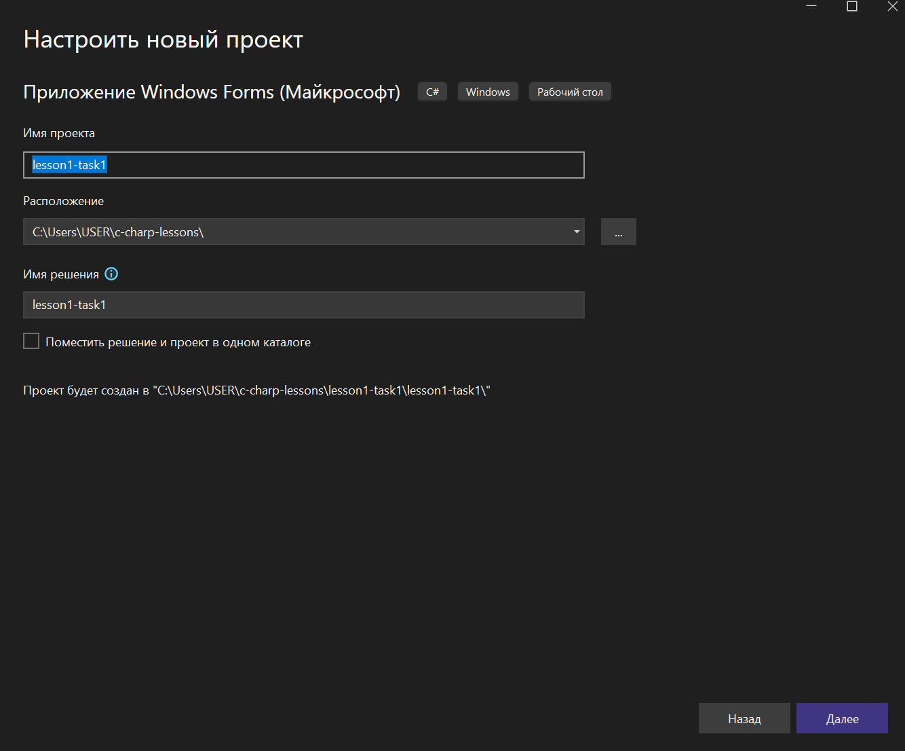
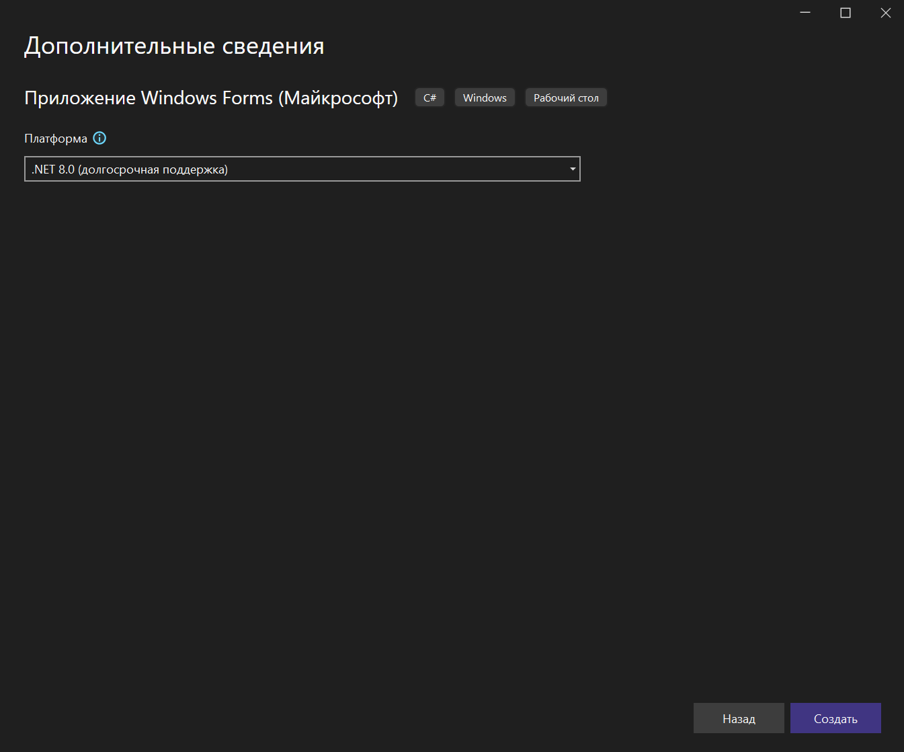

# Создание проекта windows form через VisualStudio
## Создание проекта
Порядок создания проекто
[Приложение 1](#приложение1).

## Введение
Обратите внимание что у нас есть Обозреватель проекта справа

Если в описании проекта есть слово `designer` значит это файл формы генерится
конструктором форм.

## Создание обработчиков событий
Воспользуемся конструктор форм, если кликнуть по форме, то в обозревателе
проектов, значок событий 🗲 если кликнуть по нему увидим события, нам нужно
``MouseDown`` ``MouseClick``

## приложение1

